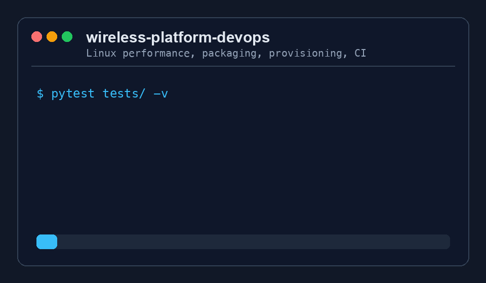

# wireless-platform-devops

<p align="center">
  
</p>

Linux DevOps toolkit for wireless platform prototypes. It ties together the work
that usually gets scattered across lab nodes: kernel/RPM packaging, PCIe and NUMA
diagnostics, Kubernetes manifests, Ansible provisioning, and Jenkins release flow.

Built as a public, safe showcase of the kind of platform work I have done in
production: 475+ Jenkins pipelines, CI reduced from 6h59m to about 15min, and
large-scale lifecycle automation work that removed $26.28M/year of waste.



## Why I Built This

Wireless prototype systems are usually messy in a very specific way. The app is
only one part of the stack. The real problems show up around CPU isolation, IRQ
affinity, bridge settings, kernel image drift, container runtime setup, and CI
pipelines that treat lab machines like regular cloud nodes.

This repo packages those concerns into a small, readable toolkit:

| Area | What it shows |
|---|---|
| Linux performance | Per-core utilization, NUMA visibility, IRQ imbalance checks |
| Networking | Bridge, route, PCIe NIC, MTU, and interface error diagnostics |
| Packaging | RPM spec generation for kernel images and PCIe drivers |
| Containers | Dev/runtime Dockerfiles and Kubernetes deployment manifests |
| Provisioning | Ansible roles for base OS and container runtime setup |
| CI/CD | Jenkins pipeline for lint, tests, RPMs, images, and deployment |

## Quick Start

```bash
python3 -m venv .venv
. .venv/bin/activate
pip install -e ".[dev]"

pytest tests/ -v
```

Useful commands:

```bash
# Monitor per-core CPU utilization and NUMA topology
sysperf --interval 2 --imbalance-threshold 25

# JSON output for scraping or automation
sysperf --interval 5 --json | jq .

# Network diagnostics: bridges, routes, PCIe NIC counters
netdiag
netdiag --watch 10

# Generate kernel image RPM spec
rpm-tooling kernel-spec --kernel-version 6.1.80-rt27

# Generate PCIe driver RPM spec
rpm-tooling driver-spec \
  --driver-name ixgbe \
  --version 5.20.3 \
  --kernel-version 6.1.80-rt27

# Provision lab nodes
ansible-playbook -i ansible/inventory/hosts.ini ansible/provision.yml

# Pin PCIe NIC IRQs to isolated CPUs 4-7
ISOLATED_CPUS=4,5,6,7 sudo bash scripts/set_irq_affinity.sh
```

## Architecture

```text
Prototype node
├── Linux kernel 6.1.x-rt
│   ├── PCIe NIC: 10/25 GbE
│   ├── IRQs pinned to isolated CPUs
│   └── NUMA-aware scheduling and memory checks
├── Docker
│   ├── platform-monitor: sysperf + netdiag
│   └── prototype runtime components
└── Kubernetes 1.29
    └── wireless-prototype namespace
        └── platform-monitor with hostNetwork=true

Build and release
└── Jenkins
    ├── lint
    ├── unit test
    ├── build RPM specs
    ├── build containers
    └── deploy manifests

Provisioning
└── Ansible
    ├── linux-base: kernel params, THP, sysctl, tuned
    └── container-runtime: Docker, Kubernetes, bridge sysctl
```

## Design Tradeoffs

This is intentionally a toolkit, not a full platform product.

| Choice | Why | Tradeoff |
|---|---|---|
| Read `/proc` and `/sys` directly | Works on locked-down Linux hosts without extra agents | Linux-specific by design |
| Generate RPM specs instead of bundling RPM artifacts | Keeps the repo public-safe and easy to inspect | Real RPM builds still need a RHEL-like builder |
| Keep Kubernetes manifests small | Shows the deployment shape without hiding details behind Helm | Less reusable than a packaged chart |
| Use Ansible for host setup | Clear fit for lab and bare-metal provisioning | Not as dynamic as image-based node replacement |
| Model 20M DAU as a capacity target | Forces the design to think about noisy nodes, autoscaling, artifact rollout, and failure isolation | This repo is not claiming a verified 20M DAU load test |

For a 20M DAU product target, I would keep this layer focused on repeatable node
state and fast rollback. The app layer can scale horizontally, but the platform
still has to answer basic questions: which kernel is running, which driver was
packaged, which CPUs are isolated, which IRQs moved, and whether the deploy path
can roll forward or back without a manual lab scramble.

## Package And Release Story

The release path is deliberately boring:

1. Jenkins runs lint and unit tests.
2. RPM specs are generated for kernel and driver packages.
3. Container images are built for diagnostics and runtime components.
4. Kubernetes manifests are applied to the prototype namespace.
5. Ansible remains the source of truth for host-level setup.

See [docs/release.md](docs/release.md) for the release checklist and package
layout.

## Validation

Verified locally:

```bash
.venv/bin/python -m pytest tests/ -v
# 32 passed
```

The repo needs `psutil` for `monitor/sysperf.py`. Running tests with a Python
environment that does not have `psutil` installed will fail during collection,
which is expected for this version.

## Requirements

```text
Python 3.9+
psutil >= 5.9
pytest

# For RPM builds
rpmbuild
createrepo_c

# For provisioning
ansible >= 2.14
RHEL 9 or CentOS Stream 9 targets

# For containers
Docker 24+
Kubernetes 1.29+
```
